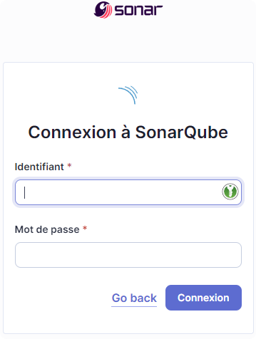
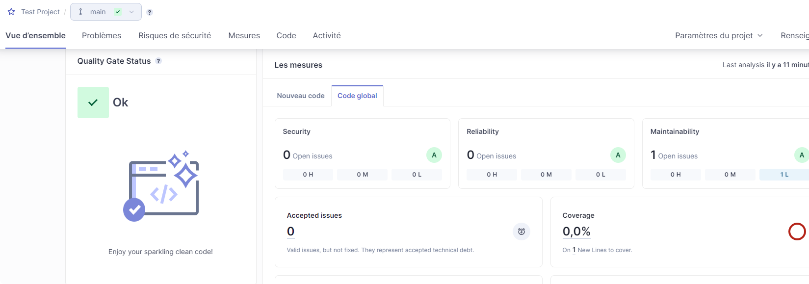

# Sonarqube


SonarQube est un logiciel libre de qualimétrie en continu de code. 

Il aide à la détection, la classification et la résolution de défaut dans le code source, permet d'identifier les duplications de code,
de mesurer le niveau de documentation et connaître la couverture de test déployée.

SonarQube permet une surveillance continue de la qualité du code grâce à son interface web 
permettant de voir les défauts de l'ensemble du code et ceux ajoutés par la nouvelle version. 

Le logiciel peut être interfacé avec un système d'automatisation comme **Jenkins** pour inclure l'analyse 
comme une extension du développement.

---

# Lancement du container

Le script suivant correspond à un `docker-compose up -d`:

```bash
bin/start
```

Le lancement peut être long.
Bien regarder les logs pour voir si des soucis de mémoire sont rencontrés.
Modifier les valeurs de mémoire affectées au container si besoin.

---

# Composer de Sonarqube

On lui passe le fichier **.env**

```
docker-compose --env-file .env -p sonarqube up 
```

* -d pour lancer en mode détaché *

---

# Accès à Sonarqube

http://localhost:9005/



## Identifiants par défaut

> A modifier directement

Login: admin
Password: admin


# En cas de souci avec vm.max_map_count

Sur windows:
```
wsl -d docker-desktop
sysctl -w vm.max_map_count=262144
```

Sur Linux:
```
sudo sysctl -w vm.max_map_count=262144
```

# Pour récupérer l'adresse URL du container

```
docker inspect sonarqube_sonarqube_1  | grep IPAddress
```

---

# Configuration de Sonarqube

## Installation de plugins

Rendez vous dans le marketplace, et installez les modules souhaités.

Conseils:
- French Language

---

## Configurer un projet sur SonarQube

Menu Projets > Create a local project
Créer un nouveau projet, et lui donner un nom.
Click the Add project button.

Give your project a Project key and a Display name and click the Set Up button.

Under Provide a token, select Generate a token. Give your token a name, click the Generate button, and click Continue. Write down your generated token, it will be used for login: d32ede54513ec7b92589139aaaa5781c121a9303.

Select your project's main language under Run analysis on your project, and follow the instructions to analyze your project. Here you'll download and execute a Scanner on your code (if you're using Maven or Gradle, the Scanner is automatically downloaded).


### Dans le dossier racine du projet

Créer un fichier de configuration dans le dossier racine du projet appelé **sonar-project.properties**:

```properties
# Nom de projet Unique
sonar.projectKey=myproject

# --- optional properties ---

# defaults to project key
sonar.projectName=My project
# defaults to 'not provided'
sonar.projectVersion=1.0

# Path is relative to the sonar-project.properties file. Defaults to .
sonar.sources=.

# Encoding of the source code. Default is default system encoding
sonar.sourceEncoding=UTF-8
```

### Sonar scanner

Download the Sonarqube scanner package and move it to the OPT directory.

Copy to ClipboardSyntax Highlighter
mkdir /downloads/sonarqube -p
cd /downloads/sonarqube
wget https://binaries.sonarsource.com/Distribution/sonar-scanner-cli/sonar-scanner-cli-4.2.0.1873-linux.zip
unzip sonar-scanner-cli-4.2.0.1873-linux.zip
mv sonar-scanner-4.2.0.1873-linux /opt/sonar-scanner


---

### Sur SonarQube


---

# Scanner un projet

Plusieurs manières de scanner un projet:

- Avec un scanner installé localement
- Avec un scanner embarqué dans un docker
- Avec une action sur GitHub
  - Nécessite que le serveurb Sonarqube soit accessible depuis l'extérieur
  - https://github.com/marketplace/actions/official-sonarqube-scan
- Avec un pipeline GitLab
- Avec un pipeline Jenkins
- ...

---

## Scanner un projet avec docker

Au préalable, il faut avoir un fichier de configuration **sonar-project.properties** dans le dossier racine du projet.

Attention aux variables à personnaliser :

```bash
docker run \
    --rm \
    -e SONAR_HOST_URL="${SONARQUBE_URL}" \
    -e SONAR_SCANNER_OPTS="-Dsonar.projectKey=${SONAR_PROJECT_KEY}" \
    -e SONAR_TOKEN="${SONAR_TOKEN}" \
    -v ${APP_PATH}:/usr/src \
    sonarsource/sonar-scanner-cli
```

${SONARQUBE_URL} : URL du serveur SonarQube
${SONAR_PROJECT_KEY} : Clé du projet (fourni à la création du projet sur SonarQube)
${SONAR_TOKEN} : Token d'authentification (fourni à la création du projet sur SonarQube)
${APP_PATH} : Chemin (**absolu**) du projet à analyser

> Source:
> https://dev.to/tacianosilva/running-a-sonarqube-server-and-client-with-docker-7bk


> Exemple:
> Dans le dossier **application-to-analyse** et dans **bin/analyse**
 
